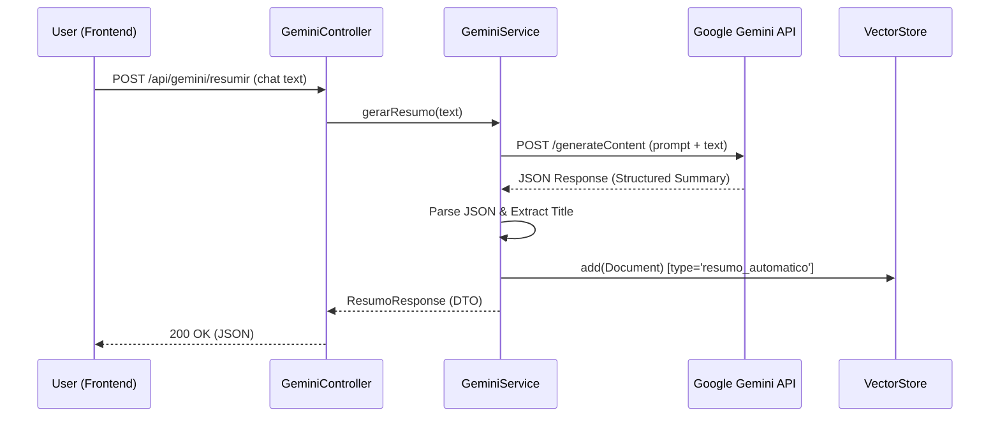
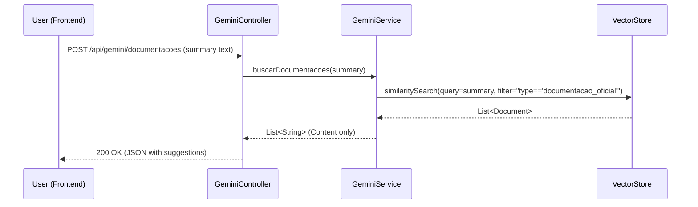
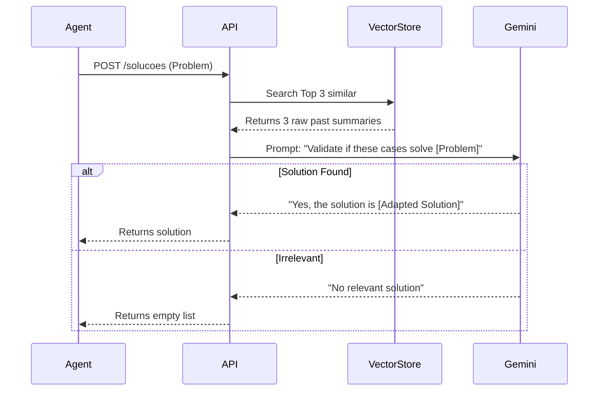

# Resumo Chat API - Project Documentation

## 1. Overview
The **Resumo Chat API** is a Spring Boot application designed to assist support agents by automatically analyzing and summarizing customer service chat logs using Google's Gemini AI. It also features a "smart knowledge base" that suggests relevant official documentation based on the generated summary, leveraging a Vector Store (RAG - Retrieval-Augmented Generation).

## 2. Architecture Overview

The system follows a standard Spring Boot MVC architecture with an added AI Service layer handling external API calls (Google Gemini) and Vector Store operations.

### High-Level Architecture (C4 Context)

```mermaid
graph TD
    User[Support Agent / Frontend] -->|HTTP POST /api/gemini/resumir| Controller[GeminiController]
    User -->|HTTP POST /api/docs| DocController[DocumentationController]
    
    subgraph "Resumo Chat API"
        Controller --> Service[GeminiService]
        DocController --> VS[VectorStore]
        Service -->|Generate Content| Gemini[Google Gemini API]
        Service -->|Store Summary / Search Docs| VS[VectorStore \n(Spring AI)]
    end
```

## 3. Core Components

### 3.1 GeminiService (`com.soften.support.gemini_resumo.service.GeminiService`)
This is the heart of the application. It has two main responsibilities:
1.  **Summarization**: Takes a raw chat transcript, prompts Gemini (Flash Lite model) to structure it into a specific format (Title, Problem, Solution, etc.), and parses the response.
    *   *Auto-learning*: After generating a summary, it automatically saves it into the `VectorStore` with metadata `type='resumo_automatico'`. This allows the system to "remember" past resolutions.
2.  **Documentation Retrieval**: Takes a summary and uses it as a semantic query to search the `VectorStore` for relevant "Official Documentation" (`type='documentacao_oficial'`).

### 3.2 Key Controllers

*   **`GeminiController`**: Handles the primary business logic flows.
    *   `POST /api/gemini/resumir`: Accepts chat text, returning a structured summary.
    *   `POST /api/gemini/documentacoes`: Accepts a summary text, returns recommended official docs.
*   **`DocumentationController`**: A CRUD interface for managing the "Official Documentation" in the vector store.
    *   `POST /api/docs`: Adds new official documentation to the knowledge base.
    *   `GET /api/docs/search`: Debug endpoint to manually search the vector store.

### 3.3 Vector Store (Spring AI)
The application uses a `VectorStore` (implementation depends on configuration, e.g., Simple, PGVector, etc.) to store two types of documents:
1.  **`resumo_automatico`**: Automatically saved past summaries.
2.  **`documentacao_oficial`**: Curated documentation added via internal APIs.

## 4. Workflows & Diagrams

### 4.1 Summarization Flow

When a user requests a summary, the system processes text and "learns" from it.



### 4.2 Documentation Suggestion Flow

After a summary is available, the frontend can request relevant documentation.



## 5. API Reference

### Extract Summary
**Endpoint:** `POST /api/gemini/resumir`
**Body:**
```json
{
  "texto": "TRANSCRIPT_TEXT_HERE"
}
```
**Response:**
```json
{
  "titulo": "Generated Title",
  "resumo": "Structured summary text..."
}
```

### Get Documentation Suggestions
**Endpoint:** `POST /api/gemini/documentacoes`
**Body:**
```json
{
  "resumo": "SUMMARY_TEXT_FOR_SEMANTIC_SEARCH"
}
```
**Response:**
```json
{
  "documentacoesSugeridas": [
    "Doc content 1...",
    "Doc content 2..."
  ]
}
```

### Manage Official Docs
**Endpoint:** `POST /api/docs`
**Body:**
```json
{
  "content": "Official documentation text...",
  "categoria": "OPTIONAL_CATEGORY"
}
```

## 6. Configuration
*   **Environment Variables**:
    *   `GEMINI_API_KEY`: API Key for Google Gemini.
*   **Application Properties**:
    *   Spring AI configuration for the chosen Vector Store.

## 7. Smart Solutions (Auto-Learning)

This feature turns your application into a **Self-Learning System**. Every time a summary is generated and saved, your database of "Solved Cases" grows.

### How to use "Suggest Solution":

**Recommended Workflow:**
1.  **Frontend**: Provide an **Input Box** for the agent to type the problem (e.g., "Erro 503 no pagamento") OR use the **Title** generated by the summary.
2.  **Avoid**: Sending raw chat logs directly, as they contain noise that reduces accuracy.

1.  **Input**: Send the problem description to the API.
2.  **API**: Searches for semantically similar past cases.
3.  **Result**: Returns the "SOLUÇÃO APRESENTADA" from the most relevant past summary.
4.  **Generative Validation**: The system sends these cases + the current problem to Gemini with a strict prompt: *"Do any of these past cases solve this new problem?"*
5.  **Synthesis**:
    *   **If yes**: Gemini extracts and adapts the solution to fit the current context.
    *   **If no**: Gemini filters it out, returning "No relevant solution found".

### Manual Knowledge Save (New)
To ensure data quality, summaries are **NOT auto-saved**.
1.  **Frontend**: Show a checkbox *"Aprovar como Solução"* after generating the summary.
2.  **Action**: If checked, call `POST /api/gemini/salvar` with the title and content.


This prevents "hallucinations" where the system might suggest an irrelevant solution just because keywords matched.

#### Diagram: Smart RAG Flow


